## 寻址公式

### 1、寻址公式一：[立即数]
> 1、读取内存的值
```asm
MOV EAX,DWORD PTR DS:[0x19FF84]
```
<div align="center"> 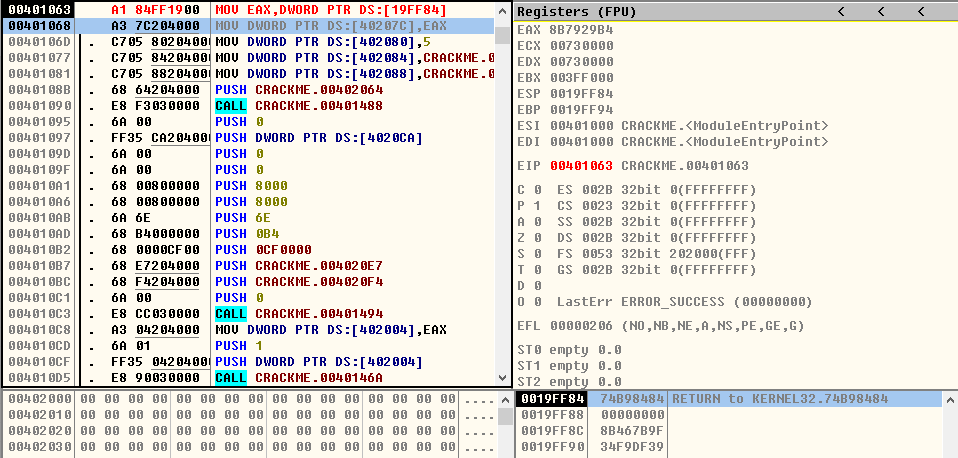 </div><br>

<div align="center"> 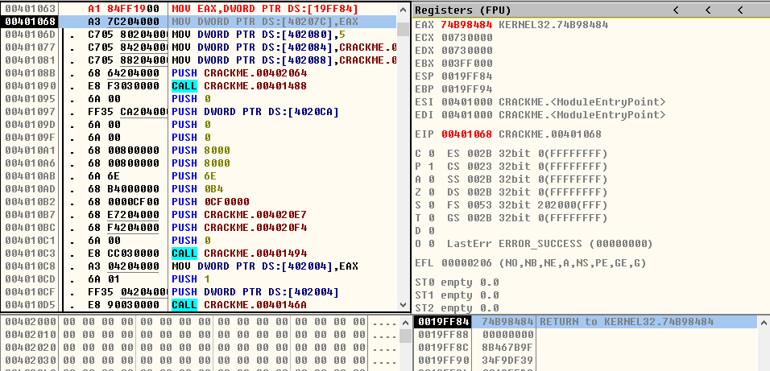 </div><br>

> 2、向内存中写入数据
```asm
MOV DWORD PTR DS:[0x19FF88],ECX
```
<div align="center"> 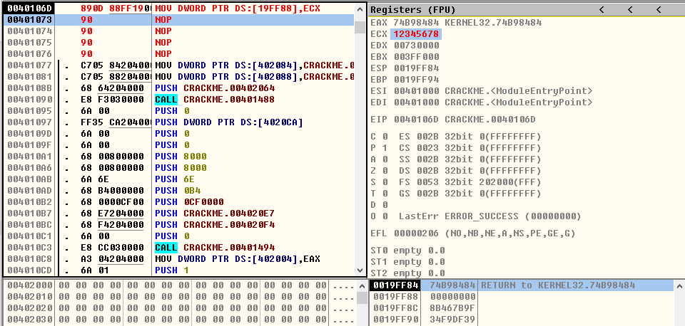 </div><br>

<div align="center"> 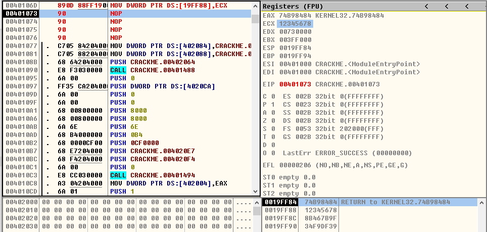 </div><br>

> 3、获取内存编号
```asm
LEA ECX,DWORD PTR DS:[0x19FF84]
```
<div align="center"> 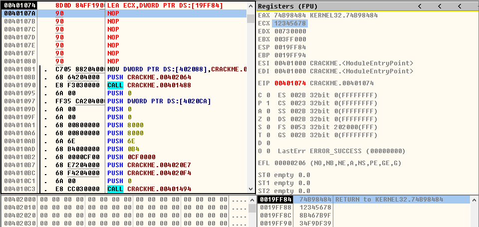 </div><br>

<div align="center"> 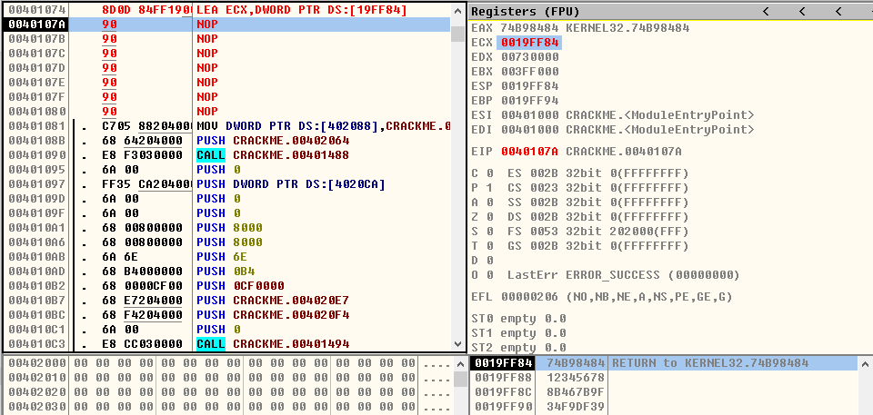 </div><br>

### 2、寻址公式一：[reg]
**【reg:代表寄存器 可以是8个通用寄存器中的任意一个】**
> 1、读取内存的值
```asm
MOV ECX,0x19FF84

MOV EAX,DWORD PTR DS:[ECX]
```
<div align="center"> 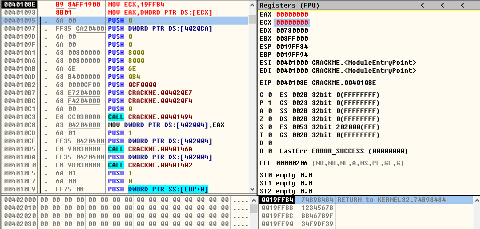 </div><br>
<div align="center"> 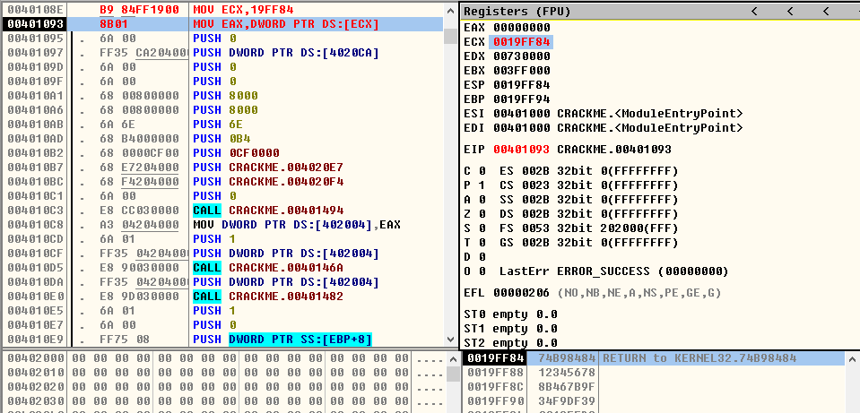 </div><br>
<div align="center"> 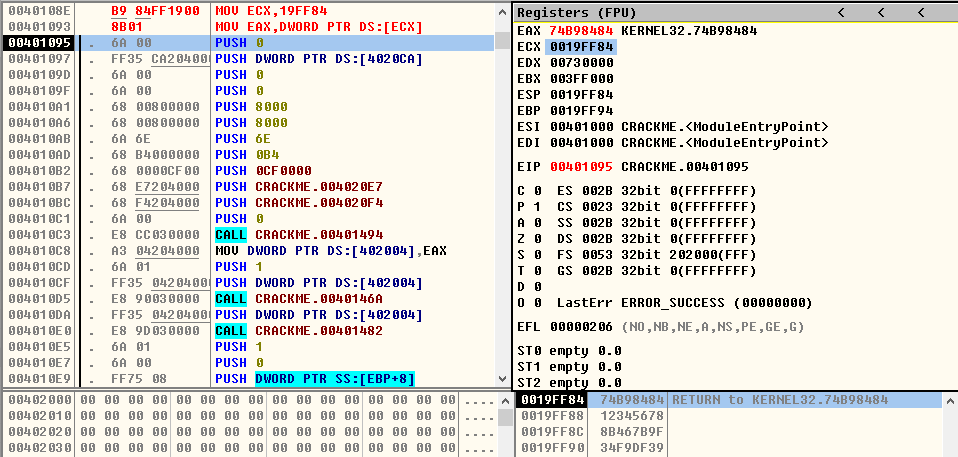 </div><br>

> 2、向内存中写入数据
```asm
MOV ECX,0x19FF88

MOV DWORD PTR DS:[ECX],0xAABBCCDD
```
<div align="center"> 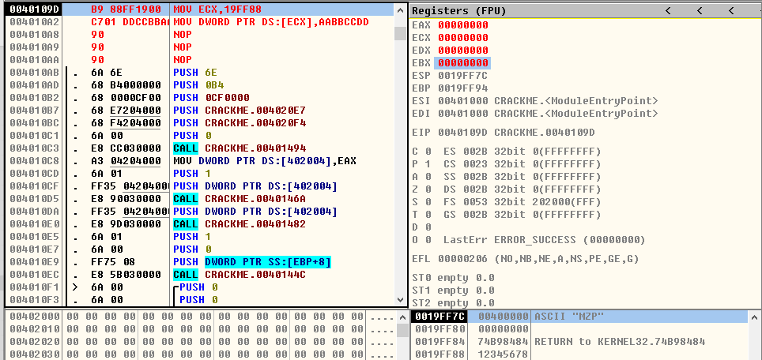 </div><br>
<div align="center"> 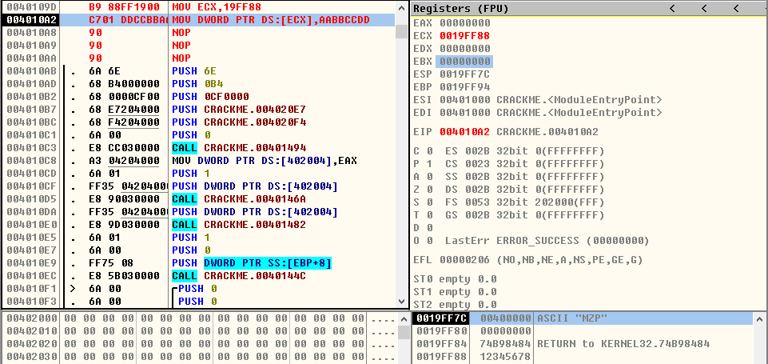 </div><br>
<div align="center">  </div><br>

> 3、获取内存编号
```asm
MOV EAX,ESP

LEA ECX,DWORD PTR DS:[EAX]

;或 LEA ECX,DWORD PTR DS:[ESP]
```
<div align="center"> 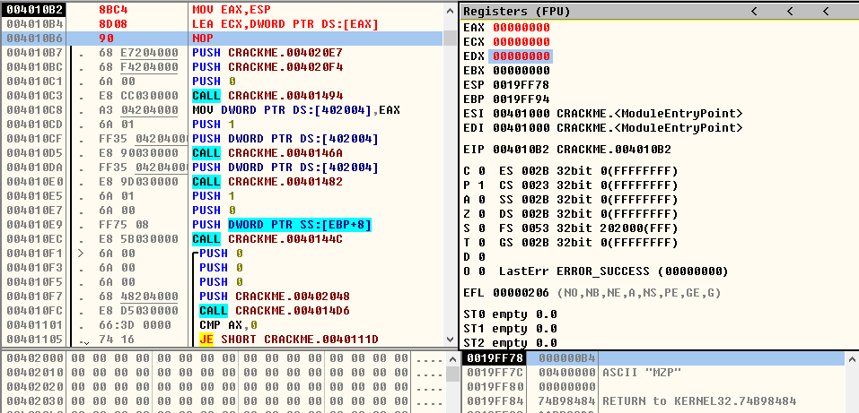 </div><br>
<div align="center">  </div><br>
<div align="center"> 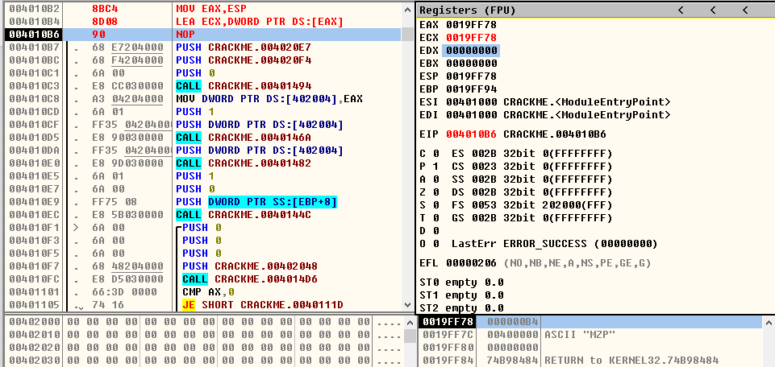 </div><br>

### 3、寻址公式三：[reg+立即数]
> 1、读取内存的值
```asm
MOV ECX,0x19FF84

MOV EAX,DWORD PTR DS:[ECX+4]
```
<div align="center"> 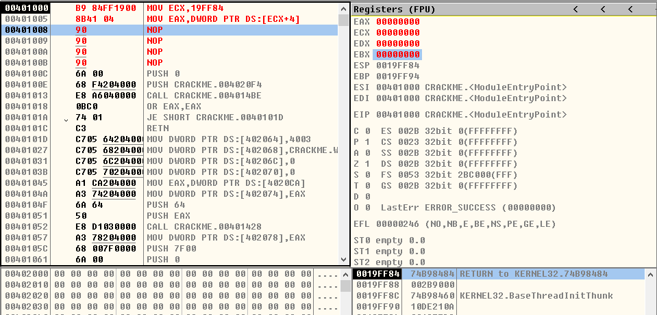 </div><br>
<div align="center"> 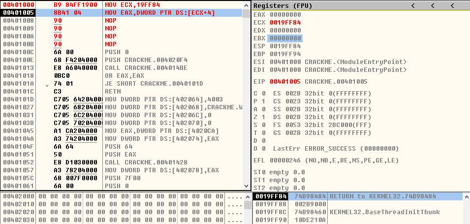 </div><br>
<div align="center"> 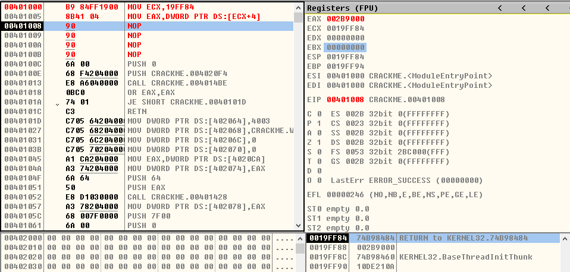 </div><br>