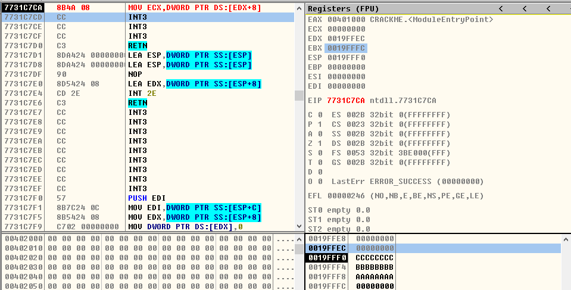
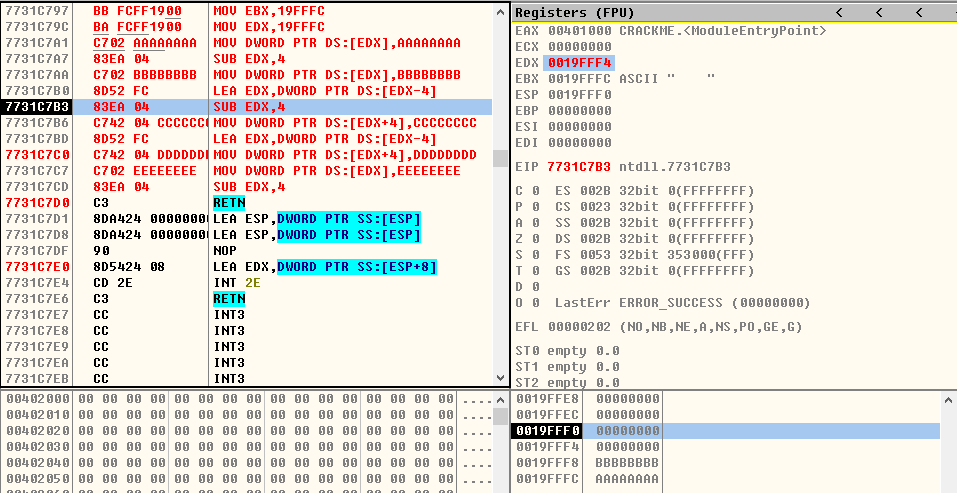

## 堆栈

### 1、压入数据
```asm
MOV EBX,0x19FFFC ;栈底 Base
MOV EDX,0x19FFFC ;栈顶 Top
```
<div align="center">  </div><br>
<div align="center">  </div><br>
<div align="center">  </div><br>

> 方式一
```asm
;先压入数据,再提升栈顶
MOV DWORD PTR DS:[EDX-4],0xAAAAAAAA
SUB EDX,0x4
```
<div align="center">  </div><br>
<div align="center">  </div><br>
<div align="center">  </div><br>

> 方式二
```asm
;先提升栈顶,再压入数据
SUB EDX,0x4
MOV DWORD PTR DS:[EDX],0xBBBBBBBB
```
<div align="center">  </div><br>
<div align="center">  </div><br>
<div align="center">  </div><br>

> 方式三
```asm
;先压入数据,再将压入数据的地址放入栈顶
MOV DWORD PTR DS:[EDX-4],0xCCCCCCCC
LEA EDX,DWORD PTR DS:[EDX-4]
```
<div align="center">  </div><br>
<div align="center">  </div><br>
<div align="center">  </div><br>

> 方式四
```asm
;先将压入数据的地址放在栈顶,再压入数据
LEA EDX,DWORD PTR DS:[EDX-4]
MOV DWORD PTR DS:[EDX],0xDDDDDDDD
```
<div align="center">  </div><br>
<div align="center">  </div><br>
<div align="center">  </div><br>

### 二、读取第N个数据
> 方式一
```asm
;通过Base加偏移来读取第一个压入的数据
MOV EAX,DWORD PTR DS:[EBX-4]
```
<div align="center">  </div><br>
<div align="center">  </div><br>

> 方式二
```asm
;通过Top加偏移来读取第二个压入的数据
MOV ECX,DWORD PTR DS:[EDX+8]
```
<div align="center">  </div><br>
<div align="center">  </div><br>

### 三、弹出数据
> 方式一
```asm
;先弹出数据,再降低栈顶
MOV ECX,DWORD PTR DS:[EDX+4]
ADD EDX,0x4
```
<div align="center">  </div><br>
<div align="center">  </div><br>
<div align="center">  </div><br>

> 方式二
```asm
;先降低栈顶,再弹出数据
ADD EDX,0x4
MOV EAX,DWORD PTR DS:[EDX]
```
<div align="center">  </div><br>
<div align="center">  </div><br>
<div align="center">  </div><br>

> 方式三
```asm
;先弹出数据,再将弹出数据的地址放入栈顶
MOV ECX,DWORD PTR DS:[EDX+4]
LEA EDX,DWORD PTR DS:[EDX+4]
```
<div align="center">  </div><br>
<div align="center">  </div><br>
<div align="center">  </div><br>

> 方式四
```asm
;先将弹出数据的地址放入栈顶,再弹出数据
LEA EDX,DWORD PTR DS:[EDX+4]
MOV EAX,DWORD PTR DS:[EDX]
```
<div align="center">  </div><br>
<div align="center">  </div><br>
<div align="center">  </div><br>

### 练习题
> 1、使用EBX存储栈底地址，EDX存储栈顶地址，连续存储5个不同的数.
```asm
MOV EBX,19FFFC
MOV EDX,19FFFC
MOV DWORD PTR DS:[EDX],0xAAAAAAAA
SUB EDX,0x4
MOV DWORD PTR DS:[EDX],0xBBBBBBBB
LEA EDX,DWORD PTR DS:[EDX-4]
SUB EDX,4
MOV DWORD PTR DS:[EDX+4],0xCCCCCCCC
LEA EDX,DWORD PTR DS:[EDX-4]
MOV DWORD PTR DS:[EDX+4],0xDDDDDDDD
MOV DWORD PTR DS:[EDX],0xEEEEEEEE
SUB EDX,4
```
<div align="center">  </div><br>
<div align="center">  </div><br>
<div align="center">  </div><br>
<div align="center">  </div><br>
<div align="center">  </div><br>
<div align="center">  </div><br>
<div align="center">  </div><br>
<div align="center">  </div><br>
<div align="center">  </div><br>
<div align="center">  </div><br>
<div align="center">  </div><br>
<div align="center">  </div><br>
<div align="center">  </div><br>