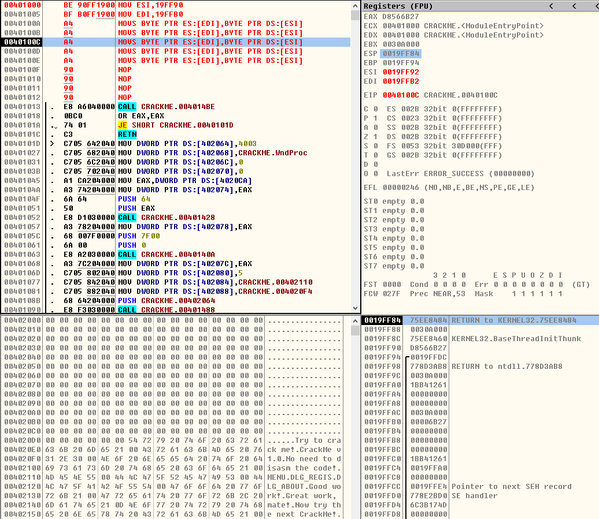
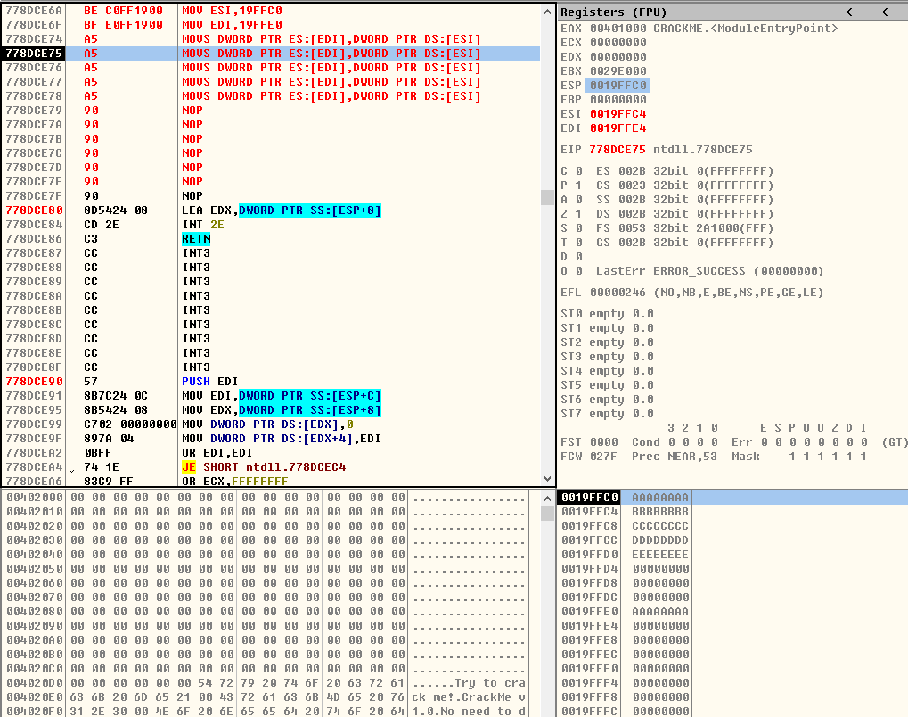
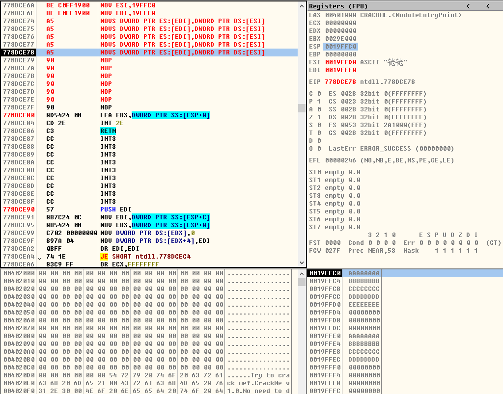
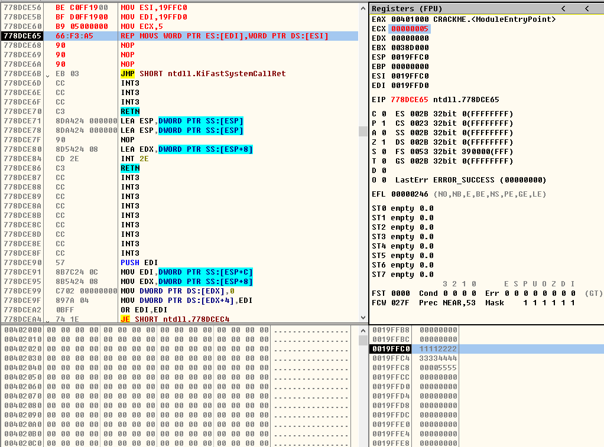
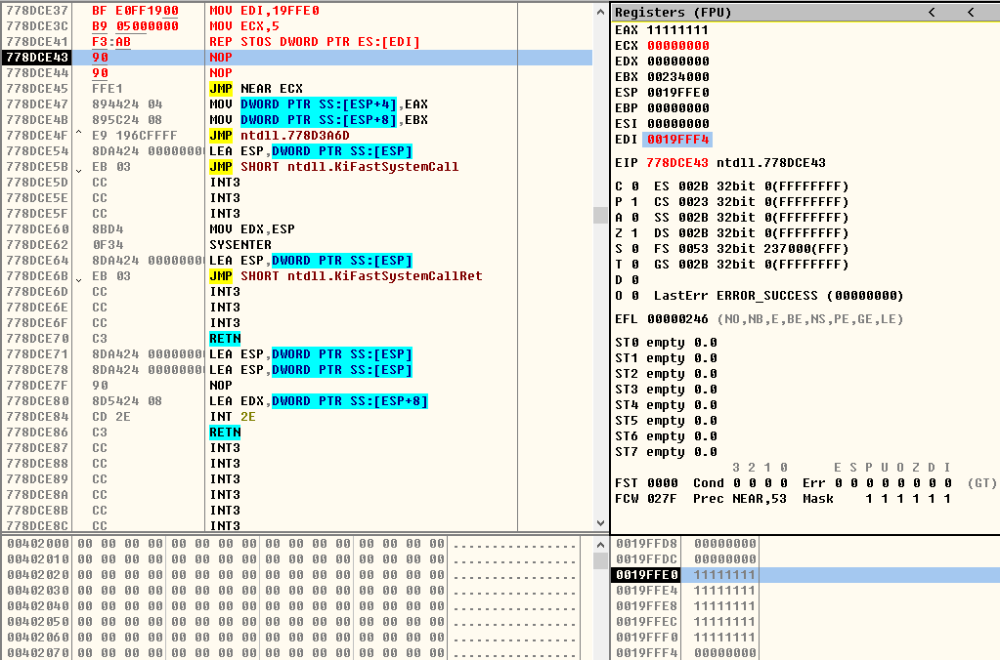

## ADC等指令

### ADC指令
> 带进位加法
```asm
;格式:两边不能同时为内存,并且宽度要一致
; ADC r8,r8/m8/imm8
; ADC r16,r16/m16/imm16
; ADC r32,r32/m32/imm32
; ADC m8,r8/imm8
; ADC m16,r16/imm16
; ADC m32,r32/imm32
; 如果CF标志寄存器的值是1,那么,结果会在正常值的基础上再加1
```

### SBB指令
> 带借位减法
```asm
;格式:两边不能同时为内存,并且宽度要一致
; SBB r8,r8/m8/imm8
; SBB r16,r16/m16/imm16
; SBB r32,r32/m32/imm32
; SBB m8,r8/imm8
; SBB m16,r16/imm16
; SBB m32,r32/imm32
; 如果CF标志寄存器的值是1,那么,结果会在正常值的基础上再减1
```

### XCHG指令
> 交换数据
```asm
;格式:两边不能同时为内存,并且宽度要一致
; XCHG r8/m8,r8/m8
; XCHG r16/m16,r16/m16
; XCHG r32/m32,r32/m32
; 将前后数据对换
```

### MOVS指令
> 移动数据:内存--内存
```asm
BYTE/WORD/DWORD

MOVS BYTE PTR ES:[EDI],BYTE PTR DS:[ESI] ;简写为：MOVSB

MOVS WORD PTR ES:[EDI],BYTE PTR DS:[ESI] ;简写为：MOVSW

MOVS DWORD PTR ES:[EDI],BYTE PTR DS:[ESI] ;简写为：MOVSD
;总结:将ESI中的值移动到EDI中,并且EDI、ESI根据DF的值进行相应的加减
;如果DF是0,那么,MOVSB加1(MOVSW加2,MOVSD加4),如果DF是1,那么,MOVSB减1(MOVSW减2,MOVSD减4)
```

### STOS指令
> 将Al/AX/EAX的值存储到[EDI]指定的内存单元
```asm
STOS BYTE PTR ES:[EDI] ;简写为STOSB

STOS WORD PTR ES:[EDI] ;简写为STOSW

STOS DWORD PTR ES:[EDI] ;简写为STOSD
;受DF标志寄存器的值影响
;如果DF是0,那么,存储完成后,EDI的值相应加1(STOSB)-2(STOSW)-4(STOSD)
;如果DF是1,那么,存储完成后,EDI的值相应减1(STOSB)-2(STOSW)-4(STOSD)
```

### REP指令
> 按计数寄存器 (ECX) 中指定的次数重复执行字符串指令
```asm
MOV ECX,10	
	
REP MOVSD	
	
REP STOSD	
```

## 练习
> 用MOVS指令分别移动5个字节、5个字、5个双字
```asm
;移动五个字节
MOV ESI,0x19FF90
MOV EDI,0x19FFB0
MOVSB
MOVSB
MOVSB
MOVSB
MOVSB
```
<div align="center">  </div><br>
<div align="center">  </div><br>
<div align="center">  </div><br>
<div align="center">  </div><br>
<div align="center">  </div><br>
<div align="center">  </div><br>
<div align="center">  </div><br>
<div align="center">  </div><br>

```asm
;移动五个字
MOV ESI,0x19FFB0
MOV EDI,0x19FFE0
MOVSW
MOVSW
MOVSW
MOVSW
MOVSW
```
<div align="center">  </div><br>
<div align="center">  </div><br>
<div align="center">  </div><br>
<div align="center">  </div><br>
<div align="center">  </div><br>
<div align="center">  </div><br>
<div align="center">  </div><br>
<div align="center">  </div><br>

```asm
;移动五个双字
MOV ESI,0x19FFC0
MOV EDI,0x19FFE0
MOVSD
MOVSD
MOVSD
MOVSD
MOVSD
```
<div align="center">  </div><br>
<div align="center">  </div><br>
<div align="center">  </div><br>
<div align="center">  </div><br>
<div align="center">  </div><br>
<div align="center">  </div><br>
<div align="center">  </div><br>
<div align="center">  </div><br>

> 用STOS指令分别存储5个字节、5个字、5个双字
```asm
;存储五个字节
MOV EDI,0x19FFD0
STOSB
STOSB
STOSB
STOSB
STOSB
```
<div align="center">  </div><br>
<div align="center">  </div><br>
<div align="center">  </div><br>
<div align="center">  </div><br>
<div align="center">  </div><br>
<div align="center">  </div><br>
<div align="center">  </div><br>

```asm
;储存五个字
MOV EDI,0x19FFE0
STOSW
STOSW
STOSW
STOSW
STOSW
```
<div align="center">  </div><br>
<div align="center">  </div><br>
<div align="center">  </div><br>
<div align="center">  </div><br>
<div align="center">  </div><br>
<div align="center">  </div><br>
<div align="center">  </div><br>

```asm
;储存五个双字
MOV EDI,0x19FFE0
STOSD
STOSD
STOSD
STOSD
STOSD
```
<div align="center">  </div><br>
<div align="center">  </div><br>
<div align="center">  </div><br>
<div align="center">  </div><br>
<div align="center">  </div><br>
<div align="center">  </div><br>
<div align="center">  </div><br>

> REP指令重复MOVS
```asm
;REP MOVSB
MOV ESI,0x19FFE0
MOV EDI,0x19FFF0
MOV ECX,0x5
REP MOVSB
```
<div align="center">  </div><br>
<div align="center">  </div><br>
<div align="center">  </div><br>
<div align="center">  </div><br>
<div align="center">  </div><br>

```asm
;REP MOVSW
MOV ESI,0x19FFC0
MOV ESI,0x19FFC0
MOV ECX,0x5
REP MOVSW
```
<div align="center">  </div><br>
<div align="center">  </div><br>
<div align="center">  </div><br>
<div align="center">  </div><br>
<div align="center">  </div><br>

```asm
;REP MOVSD
```
<div align="center">  </div><br>
<div align="center">  </div><br>
<div align="center">  </div><br>
<div align="center">  </div><br>
<div align="center">  </div><br>

> REP指令重复STOS
```asm
;REP STOSB
MOV EDI,0x19FFF0
MOV ECX,0x5
REP STOSB
```
<div align="center">  </div><br>
<div align="center">  </div><br>
<div align="center">  </div><br>
<div align="center">  </div><br>

```asm
;REP STOSW
MOV EDI,0x19FFE0
MOV ECX,0x5
REP STOSW
```
<div align="center">  </div><br>
<div align="center">  </div><br>
<div align="center">  </div><br>
<div align="center">  </div><br>

```asm
;REP STOSD
MOV EDI,0x19FFE0
MOV ECX,0x5
REP STOSD
```
<div align="center">  </div><br>
<div align="center">  </div><br>
<div align="center">  </div><br>
<div align="center">  </div><br>