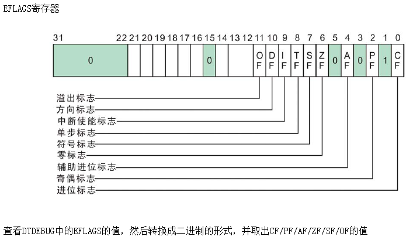

## 标志寄存器

  
 

### 1、进位标志CF(Carry Flag)
如果运算结果的**最高位**产生了一个**进位或借位**，那么，其值为1，否则其值为0。

### 2、奇偶标志PF(Parity Flag)
反映运算**结果中"1"的个数的奇偶性**。如果"1"的个数为偶数，则PF的值为1，否则其值为0。

### 3、辅助进位标志AF(Auxiliary Carry Flag)
在发生下列情况时，辅助进位标志AF的值被置为1，否则其值为0：
**(1)、在字操作时，发生低字节向高字节进位或借位时。**
**(2)、在字节操作时，发生低4位向高4位进位或借位时。**

	32位 FFFF`F`FFF

	16位 FF`F`F

	8位  F`F`

### 4、零标志ZF(Zero Flag)
反映**运算结果是否为0**。
如果运算结果为0，则其值为1，否则其值为0。在判断运算结果是否为0时，可使用此标志位。

### 5、符号标志SF(Sign Flag)
反映**运算结果的符号位**，它与运算结果的最高位相同。

	32位 FFFFFFFF -> `1`111 1111 1111 1111 1111 1111 1111 1111

	16位 FFFF -> `1`111 1111 1111 1111

	8位  FF   -> `1`111 1111

**如果最高位是1,那么SF为1,如果最高为是0，那么SF为0

### 6、溢出标志OF(Overflow Flag)
**反映有符号数加减运算所得结果是否溢出。**
如果**运算结果*****超过***当前**运算位数所能表示的范围**，则称为溢出，OF的值被置为1，否则，OF的值被清为0。

