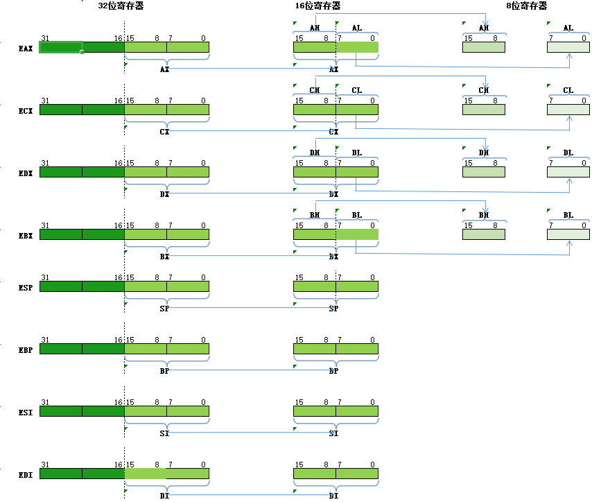

# 32位通用寄存器的指定用途如下:

| 寄存器|主要用途|编号|存储数据的范围|
| :---: | :---: | :---: | :---: |
| EAX | 累加器 | 0 | 0 - 0xFFFFFFFF |
| ECX | 计数 | 1 | 0 - 0xFFFFFFFF |
| EDX | I/O指针 | 2 | 0 - 0xFFFFFFFF |
| EBX | DS段的数据指针 | 3 | 0 - 0xFFFFFFFF |
| ESP | 堆栈指针 | 4 | 0 - 0xFFFFFFFF |
| EBP | SS段的数据指针 | 5 | 0 - 0xFFFFFFFF |
| ESI | 字符串操作的源指针;SS段的数据指针 | 6 | 0 - 0xFFFFFFFF |
| EDI | 字符串操作的目标指针;ES段的数据指针 | 7 | 0 - 0xFFFFFFFF |

# 32位寄存器 -- 16位寄存器 -- 8位寄存器

| 32位 | 16位 | 8位 |
| :---: | :---: | :---: |
| EAX | AX | AH-AL |
| ECX | CX | CH-CL |
| EDX | DX | DH-DL |
| EBX | BX | BH-BL |
| ESP | SP | - |
| EBP | BP | - |
| ESI | SI | - |
| EDI | DI | - |

  
 

# 指令

## 释义
-  **r**   通用寄存器;如:r8,指8位通用寄存器
-  **m**   内存;如:m8,指8位内存
-  **imm** 立即数;如:imm8,指8位立即数

## 指令

> [MOV指令](https://github.com/raoyanpan/asm_it/tree/master/通用寄存器/mov指令/README.md)

> [ADD指令](https://github.com/raoyanpan/asm_it/tree/master/通用寄存器/add指令/README.md)
