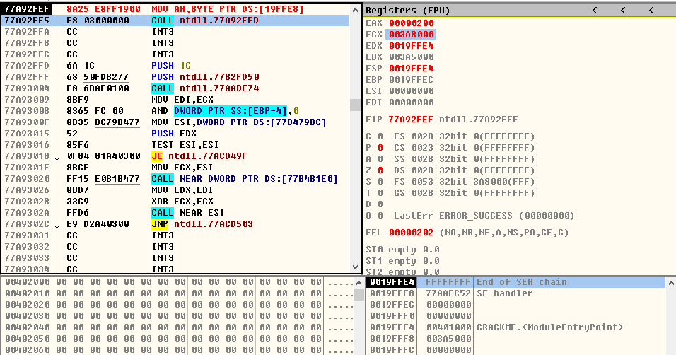
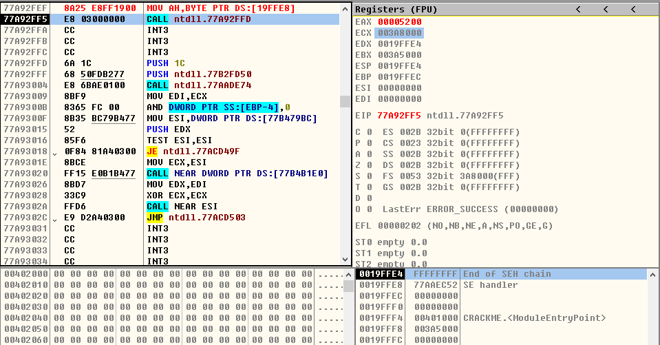
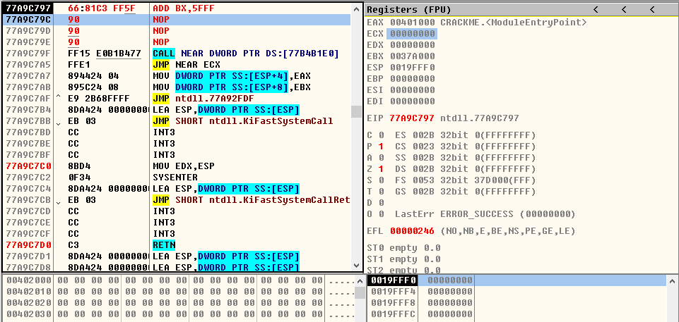
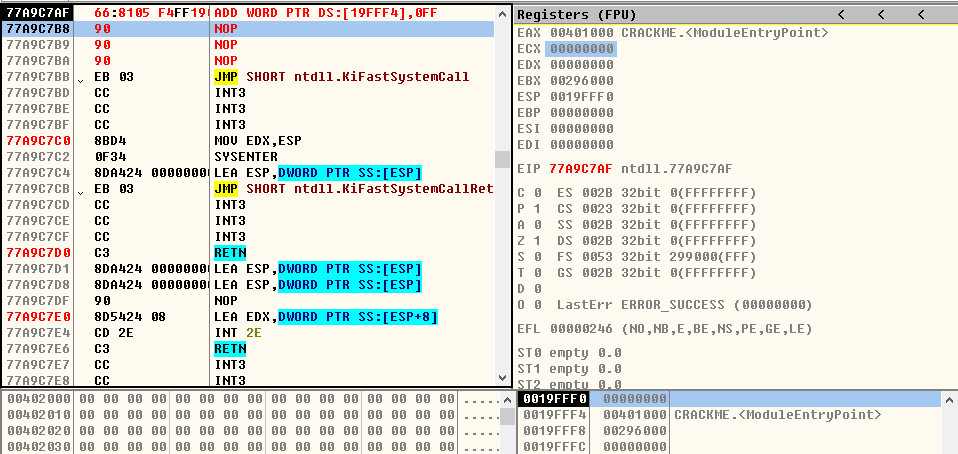
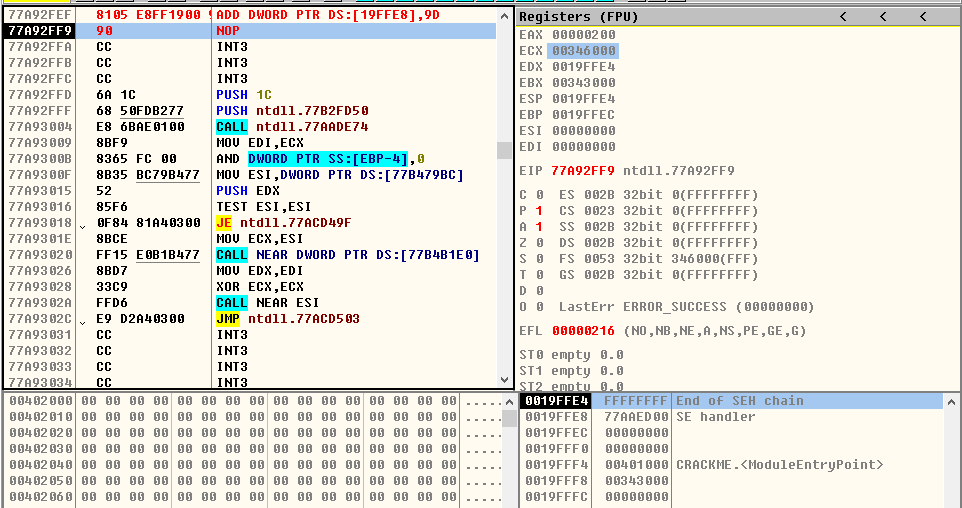

# 32位通用寄存器的指定用途如下:

| 寄存器|主要用途|编号|存储数据的范围|
| :---: | :---: | :---: | :---: |
| EAX | 累加器 | 0 | 0 - 0xFFFFFFFF |
| ECX | 计数 | 1 | 0 - 0xFFFFFFFF |
| EDX | I/O指针 | 2 | 0 - 0xFFFFFFFF |
| EBX | DS段的数据指针 | 3 | 0 - 0xFFFFFFFF |
| ESP | 堆栈指针 | 4 | 0 - 0xFFFFFFFF |
| EBP | SS段的数据指针 | 5 | 0 - 0xFFFFFFFF |
| ESI | 字符串操作的源指针;SS段的数据指针 | 6 | 0 - 0xFFFFFFFF |
| EDI | 字符串操作的目标指针;ES段的数据指针 | 7 | 0 - 0xFFFFFFFF |

# 32位寄存器 -- 16位寄存器 -- 8位寄存器

| 32位 | 16位 | 8位 |
| :---: | :---: | :---: |
| EAX | AX | AH-AL |
| ECX | CX | CH-CL |
| EDX | DX | DH-DL |
| EBX | BX | BH-BL |
| ESP | SP | - |
| EBP | BP | - |
| ESI | SI | - |
| EDI | DI | - |

  
 

# 指令

## 释义
-  **r**   通用寄存器;如:r8,指8位通用寄存器
-  **m**   内存;如:m8,指8位内存
-  **imm** 立即数;如:imm8,指8位立即数

## MOV指令

### MOV指令释义
- **语法结构:** MOV 目标操作数,源操作数
- **作用:** 拷贝源操作数到目标操作数
*  1、源操作数可以是立即数(imm)、通用寄存器(r)、段寄存器、或者内存单元.
*  2、目标操作数可以是通用寄存器、段寄存器或者内存单元.
*  3、操作数的宽度必须一样.
*  4、源操作数和目标操作数不能同时为内存单元.

> 1、MOV r/m8,r8
- **MOV CL,BH**
* ***运行前***

  
 

* ***运行后***

  
 

- **MOV BYTE PTR DS:[0x19FFF0],AH**
* ***运行前***

  
 

* ***运行后***

  
 

> 2、MOV r/m16,r16
- **MOV CX,BX**
* ***运行前***

  
 

* ***运行后***

  
 

- **MOV WORD PTR DS:[0x19FFF0],BX**
* ***运行前***

  
 

* ***运行后***

  
 

> 3、MOV r/m32,r32
- **MOV ECX,EBX**
* ***运行前***

  
 

* ***运行后***

  
 

- **MOV DWORD PTR DS:[0x19FFF0],EAX**
* ***运行前***

  
 

* ***运行后***

  
 

> 4、MOV r8,r/m8
- **MOV CH,AH**
* ***运行前***

  
 

* ***运行后***

  
 

- **MOV AH,BYTE PTR DS:[0x19FFE8]**
* ***运行前***

  
 

* ***运行后***

  
 

> 5、MOV r16,r/m16
- **MOV CX,BX**
* ***运行前***

  
 

* ***运行后***

  
 

- **MOV AX,WORD PTR DS:[0x19FFE8]**
* ***运行前***

  
 

* ***运行后***

  
 

> 6、MOV r32,r/m32
- **MOV ECX,EAX**
* ***运行前***

  
 

* ***运行后***

  
 

- **MOV EAX,DWORD PTR DS:[0x19FFE8]**
* ***运行前***

  
 

* ***运行后***

  
 

> 7、MOV r8,imm8
- **MOV CL,0xFF**
* ***运行前***

  
 

* ***运行后***

  
 

> 8、MOV r16,imm16
- **MOV DX,0x1234**
* ***运行前***

  
 

* ***运行后***

  
 

> 9、MOV r32,imm32
- **MOV ECX,0x12345678**
* ***运行前***

  
 

* ***运行后***

  
 

## ADD指令
> 1、ADD r/m8,imm8
- **ADD AL,0xFF**
* ***运行前***

  
 

* ***运行后***

  
 

- **ADD BYTE PTR DS:[0x19FFE8],0xB5**
* ***运行前***

  
 

* ***运行后***

  
 

> 2、ADD r/m16,imm16
- **ADD BX,0x5FFF**
* ***运行前***

  
 

* ***运行后***

  
 

- **ADD WORD PTR DS:[0x19FFF0],0x1234**
* ***运行前***

  
 

* ***运行后***

  
 

> 3、ADD r/m32,imm32
- **ADD EAX,0xFFBFEFFF**
* ***运行前***

  
 

* ***运行后***

  
 

- **ADD DWORD PTR DS:[0x19FFF4],0xFFBFEFFF**
* ***运行前***

  
 

* ***运行后***

  
 

> 4、ADD r/m16,imm8
- **ADD CX,1**
* ***运行前***

  
 

* ***运行后***

  
 

- **ADD WORD PTR DS:[0x19FFF4],0xFF**
* ***运行前***

  
 

* ***运行后***

  
 

> 5、ADD r/m32,imm8
- **ADD EBX,0x12**
* ***运行前***

  
 

* ***运行后***

  
 

- **ADD DWORD PTR DS:[0x19FFE8],0x9D**
* ***运行前***

  
 

* ***运行后***

  
 