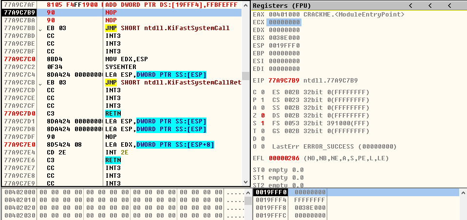
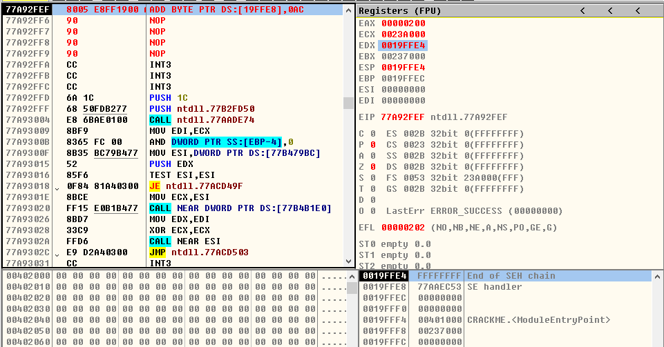
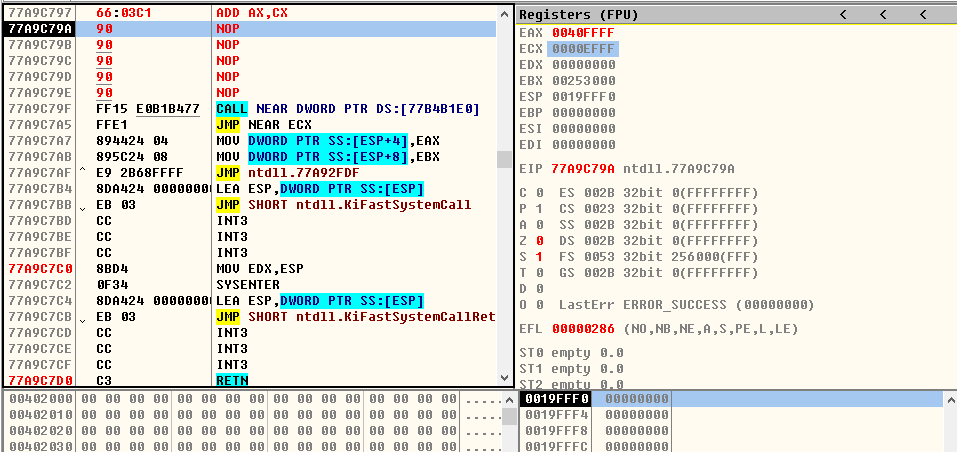

## ADD指令
> 1、ADD r/m8,imm8
- **ADD AL,0xFF**
* ***运行前***

  
 

* ***运行后***

  
 

- **ADD BYTE PTR DS:[0x19FFE8],0xB5**
* ***运行前***

  
 

* ***运行后***

  
 

> 2、ADD r/m16,imm16
- **ADD BX,0x5FFF**
* ***运行前***

  
 

* ***运行后***

  
 

- **ADD WORD PTR DS:[0x19FFF0],0x1234**
* ***运行前***

  
 

* ***运行后***

  
 

> 3、ADD r/m32,imm32
- **ADD EAX,0xFFBFEFFF**
* ***运行前***

  
 

* ***运行后***

  
 

- **ADD DWORD PTR DS:[0x19FFF4],0xFFBFEFFF**
* ***运行前***

  
 

* ***运行后***

  
 

> 4、ADD r/m16,imm8
- **ADD CX,1**
* ***运行前***

  
 

* ***运行后***

  
 

- **ADD WORD PTR DS:[0x19FFF4],0xFF**
* ***运行前***

  
 

* ***运行后***

  
 

> 5、ADD r/m32,imm8
- **ADD EBX,0x12**
* ***运行前***

  
 

* ***运行后***

  
 

- **ADD DWORD PTR DS:[0x19FFE8],0x9D**
* ***运行前***

  
 

* ***运行后***

  
 

> 6、ADD r/m8,r8
- **ADD DH,CL**
* ***运行前***

  
 

* ***运行后***

  
 

- **ADD BYTE PTR DS:[19FFE8],0xAC**
* ***运行前***

  
 

* ***运行后***

  
 

> 7、ADD r/m16,r16
- **ADD AX,CX**
* ***运行前***

  
 

* ***运行后***

  
 

- **ADD WORD PTR DS:[0x19FFF4],CX**
* ***运行前***

  
 

* ***运行后***

  
 

> 8、ADD r/m32,r32
- **ADD EAX,ECX**
* ***运行前***

  
 

* ***运行后***

  
 

- **ADD DWORD PTR DS:[0x19FFF4],ECX**
* ***运行前***

  
 

* ***运行后***

  
 