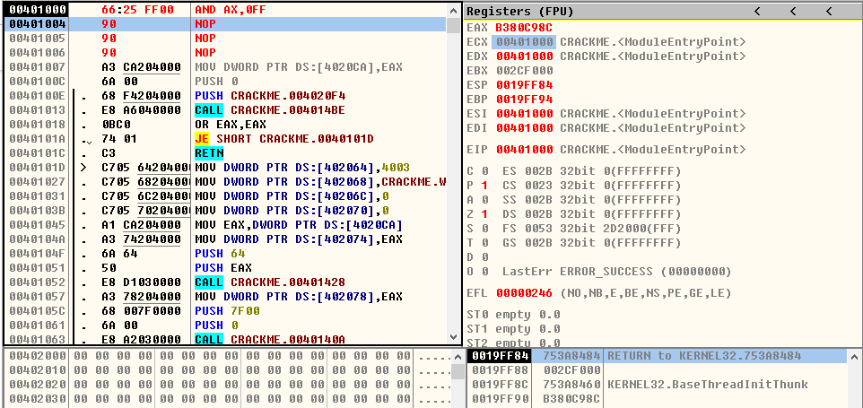
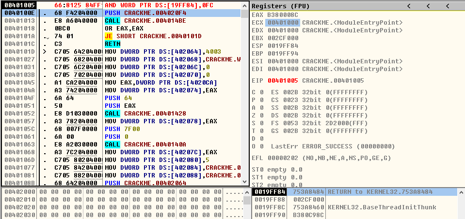

## AND指令

> 1、AND r/m8,imm8
- **AND CL,0xF8**
* ***运行前***

  
 

* ***运行后***

  
  

- **AND BYTE PTR DS:[0x19FFE8],0x9E**
* ***运行前***

  
 

* ***运行后***

  
 

> 2、AND r/m16,imm16
- **AND AX,0xABCD**
* ***运行前***

  
 

* ***运行后***

  
  

- **AND WORD PTR DS:[0x19FFE8],0x1A2D**
* ***运行前***

  
 

* ***运行后***

  
 

> 3、AND r/m32,imm32
- **AND EDX,0x3A11B5**
* ***运行前***

  
 

* ***运行后***

  
  

- **AND DWORD PTR DS:[0x19FF84],0xABCD9876**
* ***运行前***

  
 

* ***运行后***

  
 

> 4、AND r/m16,imm8
- **AND AX,0xFF**
* ***运行前***

  
 

* ***运行后***

  
  

- **AND WORD PTR DS:[0x19FF84],0xFC**
* ***运行前***

  
 

* ***运行后***

  
 

> 5、AND r/m32,imm8
- **AND EAX,0x99**
* ***运行前***

  
 

* ***运行后***

  
  

- **AND DWORD PTR DS:[0x19FF80],0xF8**
* ***运行前***

  
 

* ***运行后***

  
 