## MOV指令

### MOV指令释义
- **语法结构:** MOV 目标操作数,源操作数
- **作用:** 拷贝源操作数到目标操作数
*  1、源操作数可以是立即数(imm)、通用寄存器(r)、段寄存器、或者内存单元.
*  2、目标操作数可以是通用寄存器、段寄存器或者内存单元.
*  3、操作数的宽度必须一样.
*  4、源操作数和目标操作数不能同时为内存单元.

> 1、MOV r/m8,r8
- **MOV CL,BH**
* ***运行前***

  
 

* ***运行后***

  
 

- **MOV BYTE PTR DS:[0x19FFF0],AH**
* ***运行前***

  
 

* ***运行后***

 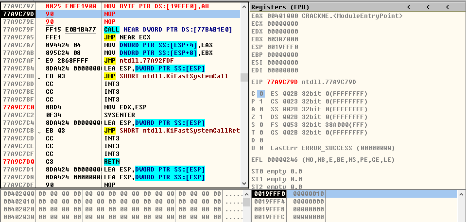 
 

> 2、MOV r/m16,r16
- **MOV CX,BX**
* ***运行前***

  
 

* ***运行后***

 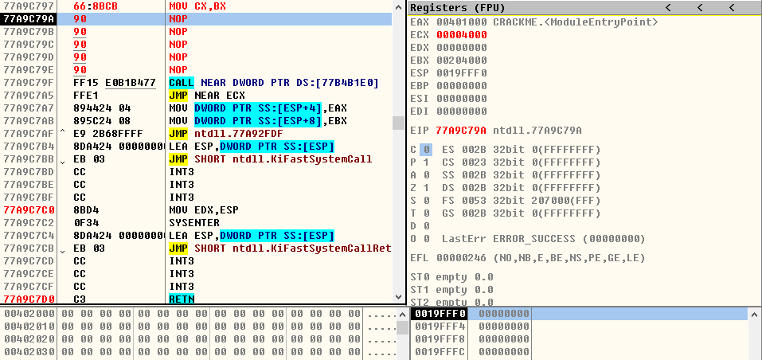 
 

- **MOV WORD PTR DS:[0x19FFF0],BX**
* ***运行前***

 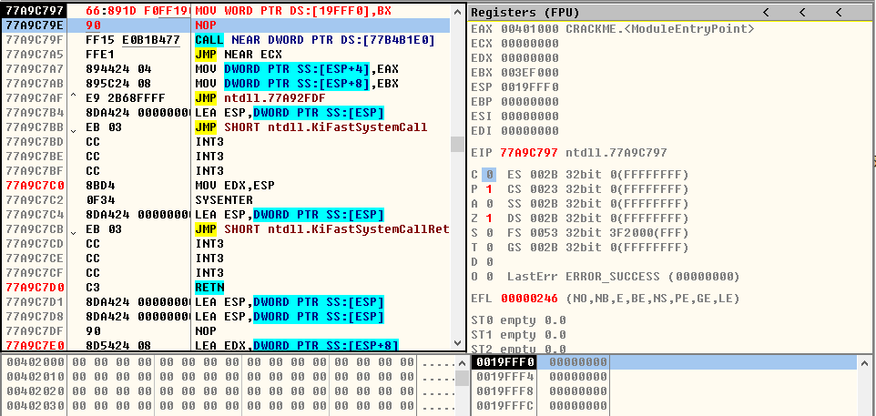 
 

* ***运行后***

 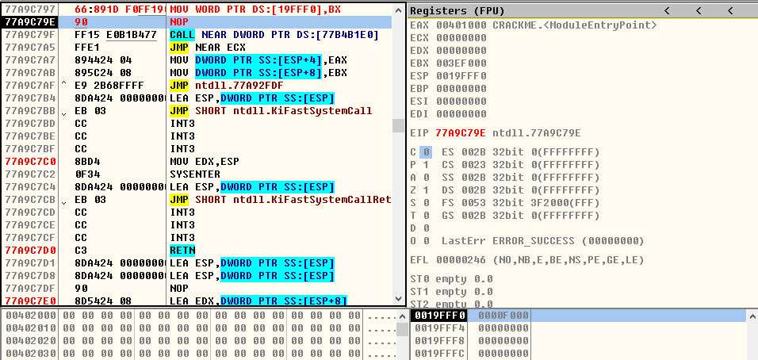 
 

> 3、MOV r/m32,r32
- **MOV ECX,EBX**
* ***运行前***

 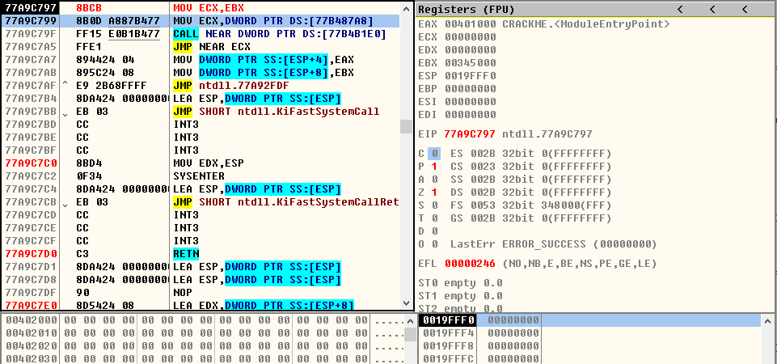 
 

* ***运行后***

  
 

- **MOV DWORD PTR DS:[0x19FFF0],EAX**
* ***运行前***

 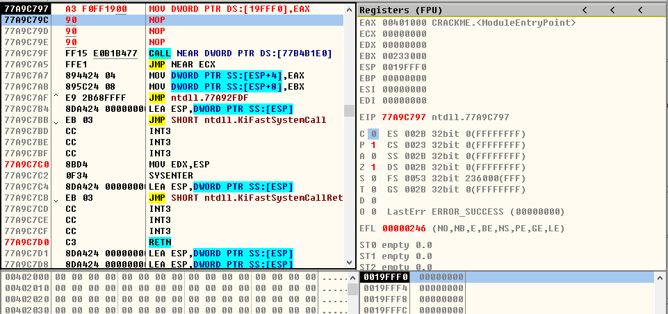 
 

* ***运行后***

 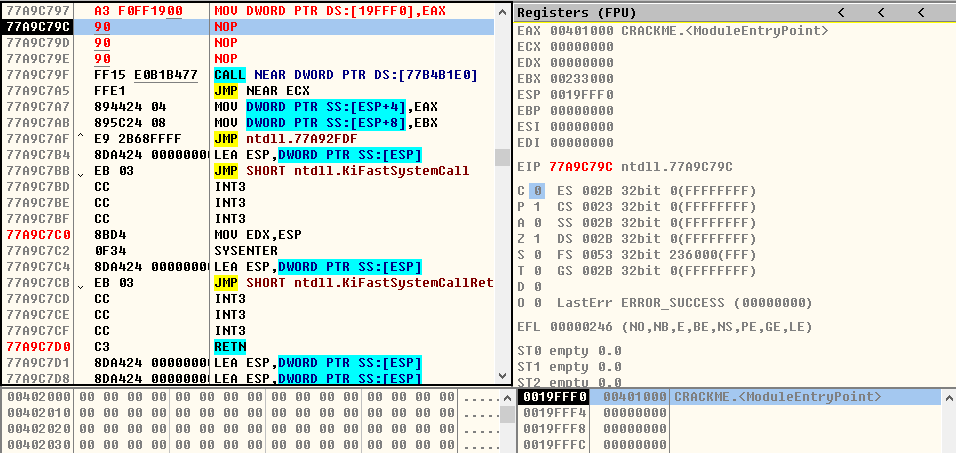 
 

> 4、MOV r8,r/m8
- **MOV CH,AH**
* ***运行前***

  
 

* ***运行后***

 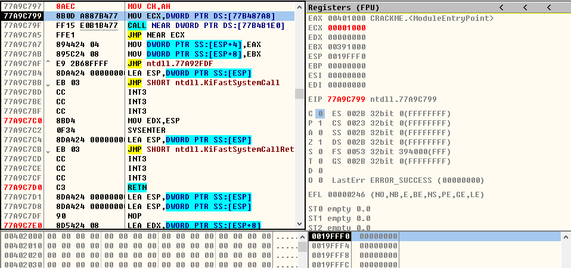 
 

- **MOV AH,BYTE PTR DS:[0x19FFE8]**
* ***运行前***

 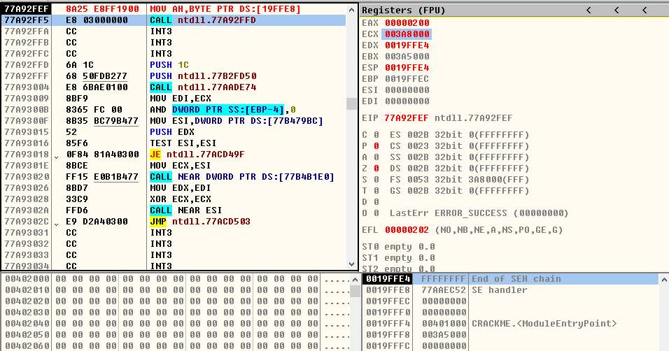 
 

* ***运行后***

 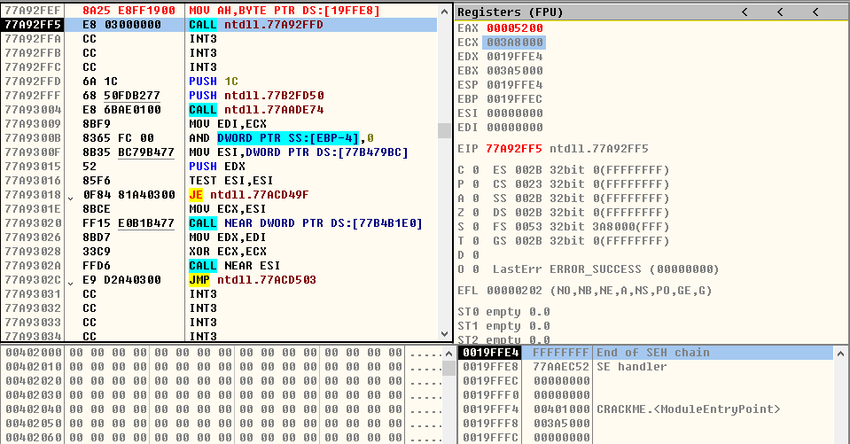 
 

> 5、MOV r16,r/m16
- **MOV CX,BX**
* ***运行前***

 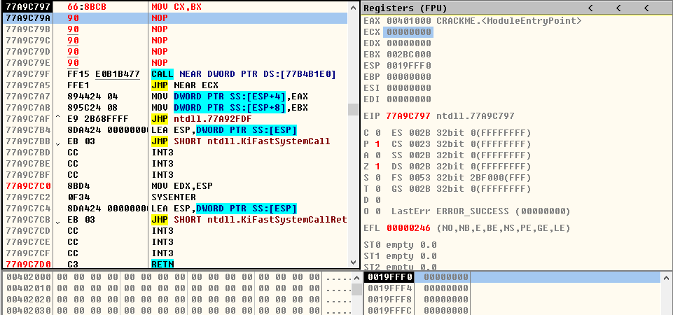 
 

* ***运行后***

  
 

- **MOV AX,WORD PTR DS:[0x19FFE8]**
* ***运行前***

 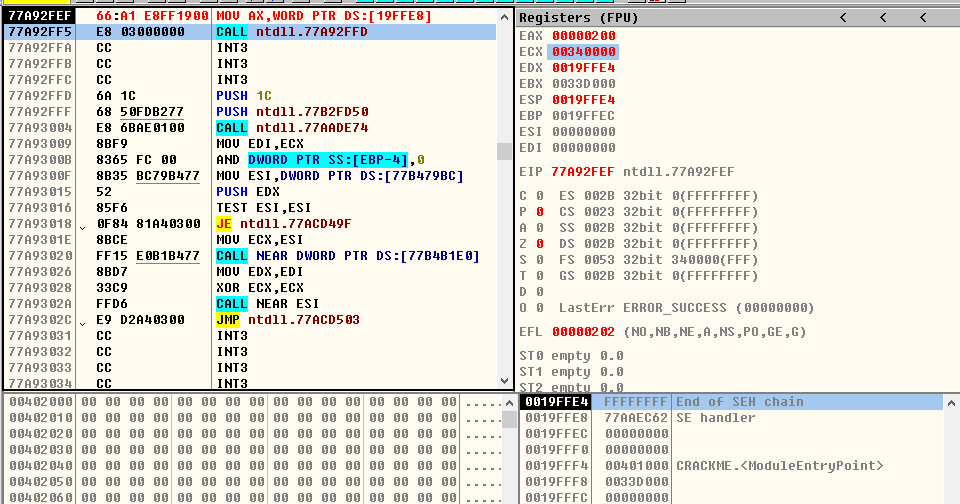 
 

* ***运行后***

 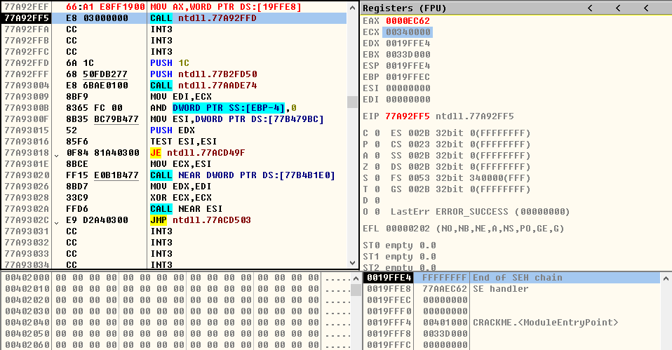 
 

> 6、MOV r32,r/m32
- **MOV ECX,EAX**
* ***运行前***

  
 

* ***运行后***

  
 

- **MOV EAX,DWORD PTR DS:[0x19FFE8]**
* ***运行前***

 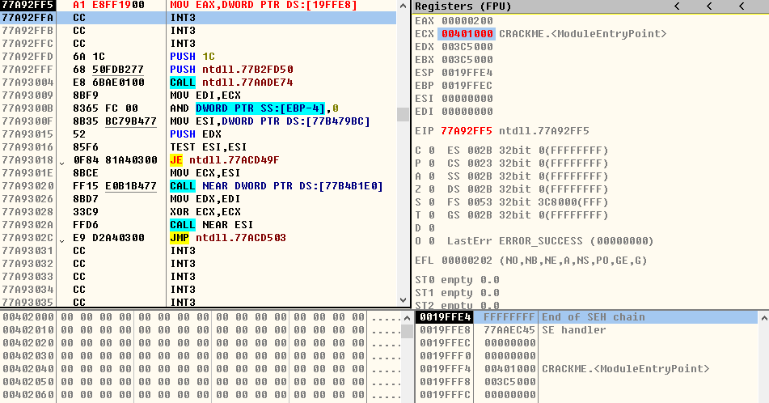 
 

* ***运行后***

 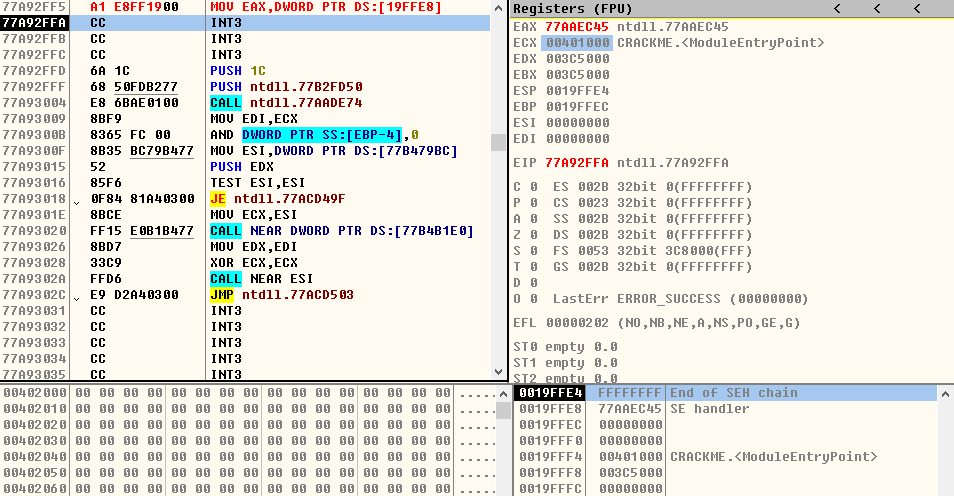 
 

> 7、MOV r8,imm8
- **MOV CL,0xFF**
* ***运行前***

  
 

* ***运行后***

 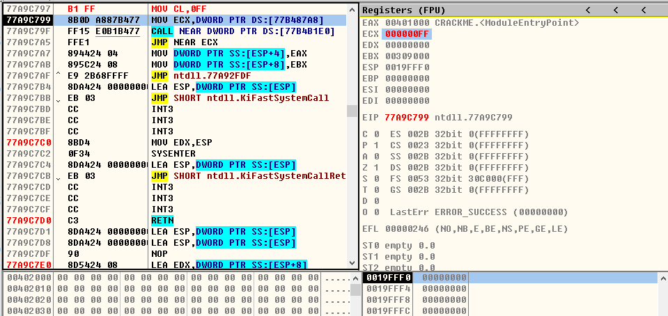 
 

> 8、MOV r16,imm16
- **MOV DX,0x1234**
* ***运行前***

 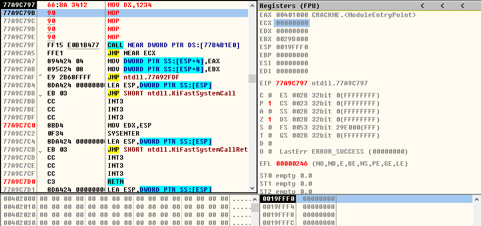 
 

* ***运行后***

  
 

> 9、MOV r32,imm32
- **MOV ECX,0x12345678**
* ***运行前***

 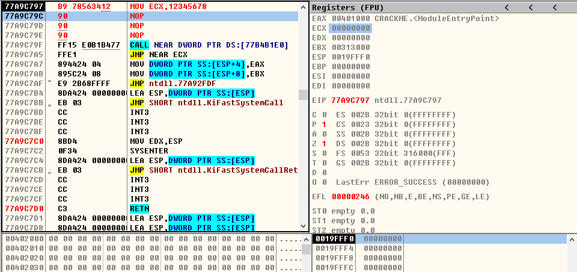 
 

* ***运行后***

 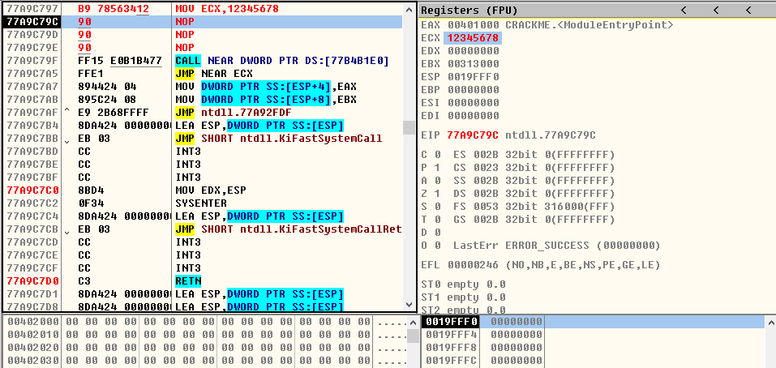 
 