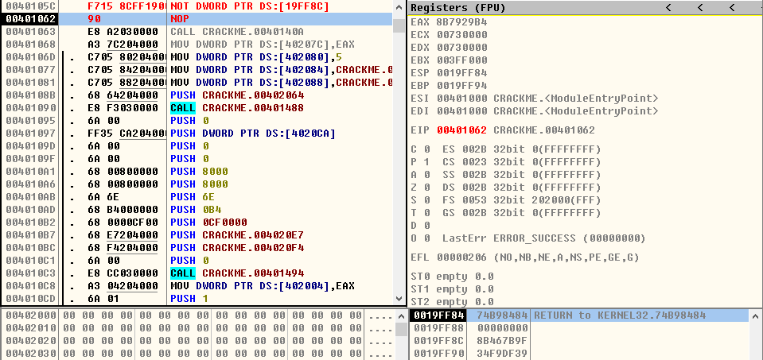

## NOT指令

> 1、NOT r/m8
- **NOT AL**
* ***运行前***

  
 

* ***运行后***

  
  

- **NOT BYTE PTR DS:[0x19FF90]**
* ***运行前***

  
 

* ***运行后***

  
 

> 2、NOT r/m16
- **NOT AX**
* ***运行前***

  
 

* ***运行后***

  
  

- **NOT WORD PTR DS:[0x19FF90]**
* ***运行前***

  
 

* ***运行后***

  
 

> 3、NOT r/m32
- **NOT EAX**
* ***运行前***

  
 

* ***运行后***

  
  

- **NOT DWORD PTR DS:[0x19FF8C]**
* ***运行前***

  
 

* ***运行后***

  
 