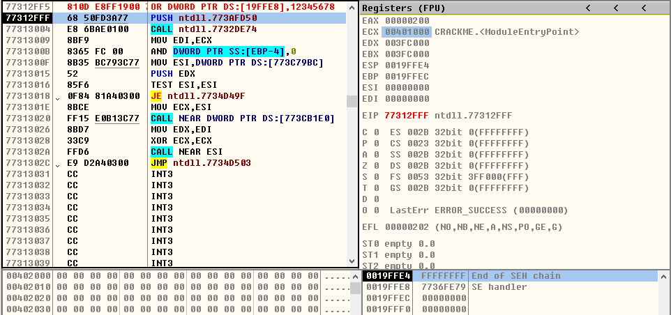
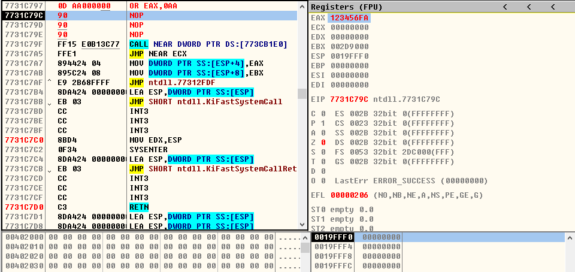

## OR指令

> 1、OR r/m8,imm8
- **OR CL,0x55**
* ***运行前***

  
 

* ***运行后***

  
  

- **OR BYTE PTR DS:[0x19FFE8],0xDA**
* ***运行前***

  
 

* ***运行后***

  
 

> 2、OR r/m16,imm16
- **OR AX,6789**
* ***运行前***

  
 

* ***运行后***

  
  

- **OR WORD PTR DS:[19FF90],0ABCD**
* ***运行前***

  
 

* ***运行后***

  
 

> 3、OR r/m32,imm32
- **OR ECX,0x12345678**
* ***运行前***

  
 

* ***运行后***

  
  

- **OR DWORD PTR DS:[0x19FFE8],0x12345678**
* ***运行前***

  
 

* ***运行后***

  
 

> 4、OR r/m16,imm8
- **OR AX,0x23**
* ***运行前***

  
 

* ***运行后***

  
  

- **OR WORD PTR DS:[19FFE8],1B**
* ***运行前***

  
 

* ***运行后***

  
 

> 5、OR r/m32,imm8
- **OR EAX,0xAA**
* ***运行前***

  
 

* ***运行后***

  
  

- **OR DWORD PTR DS:[0x19FF90],0xCC**
* ***运行前***

  
 

* ***运行后***

  
 