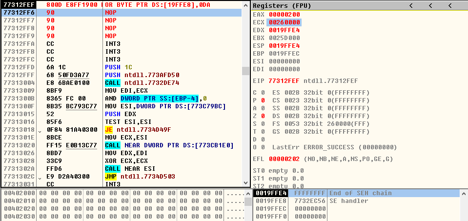
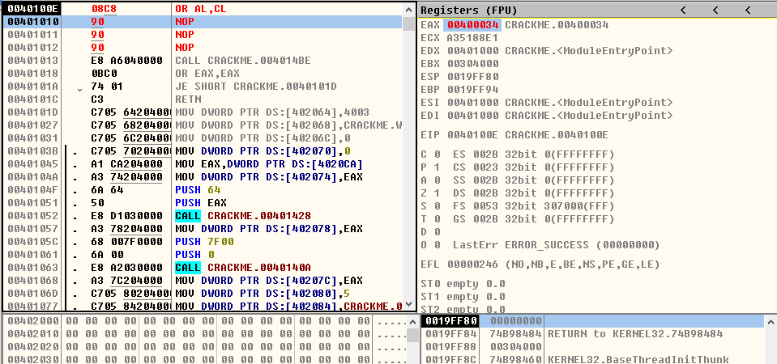
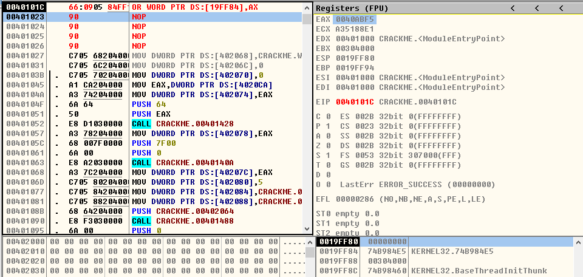

## OR指令

> 1、OR r/m8,imm8
- **OR CL,0x55**
* ***运行前***

  
 

* ***运行后***

  
  

- **OR BYTE PTR DS:[0x19FFE8],0xDA**
* ***运行前***

  
 

* ***运行后***

  
 

> 2、OR r/m16,imm16
- **OR AX,6789**
* ***运行前***

  
 

* ***运行后***

  
  

- **OR WORD PTR DS:[19FF90],0ABCD**
* ***运行前***

  
 

* ***运行后***

  
 

> 3、OR r/m32,imm32
- **OR ECX,0x12345678**
* ***运行前***

  
 

* ***运行后***

  
  

- **OR DWORD PTR DS:[0x19FFE8],0x12345678**
* ***运行前***

  
 

* ***运行后***

  
 

> 4、OR r/m16,imm8
- **OR AX,0x23**
* ***运行前***

  
 

* ***运行后***

  
  

- **OR WORD PTR DS:[19FFE8],1B**
* ***运行前***

  
 

* ***运行后***

  
 

> 5、OR r/m32,imm8
- **OR EAX,0xAA**
* ***运行前***

  
 

* ***运行后***

  
  

- **OR DWORD PTR DS:[0x19FF90],0xCC**
* ***运行前***

  
 

* ***运行后***

  
 

> 6、OR r/m8,r8
- **OR AL,CL**
* ***运行前***

  
 

* ***运行后***

  
  

- **OR BYTE PTR DS:[0x19FF84],CL**
* ***运行前***

  
 

* ***运行后***

  
 

> 7、OR r/m16,r16
- **OR AX,CX**
* ***运行前***

  
 

* ***运行后***

  
  

- **OR WORD PTR DS:[0x19FF84],AX**
* ***运行前***

  
 

* ***运行后***

  
 

> 8、OR r/m32,r32
- **OR EAX,ECX**
* ***运行前***

  
 

* ***运行后***

  
  

- **OR DWORD PTR DS:[0x19FF84],EAX**
* ***运行前***

  
 

* ***运行后***

  
 

> 9、OR r8,r/m8
- **OR AH,CH**
* ***运行前***

  
 

* ***运行后***

  
  

- **OR AL,BYTE PTR DS:[0x19FF90]**
* ***运行前***

  
 

* ***运行后***

  
 

> 10、OR r16,r/m16
- **OR CX,BX**
* ***运行前***

  
 

* ***运行后***

  
  

- **OR CX,WORD PTR DS:[0x19FF90]**
* ***运行前***

  
 

* ***运行后***

  
 

> 11、OR r32,r/m32
- **OR EAX,ECX**
* ***运行前***

  
 

* ***运行后***

  
  

- **OR ECX,DWORD PTR DS:[0x19FF90]**
* ***运行前***

  
 

* ***运行后***

  
 