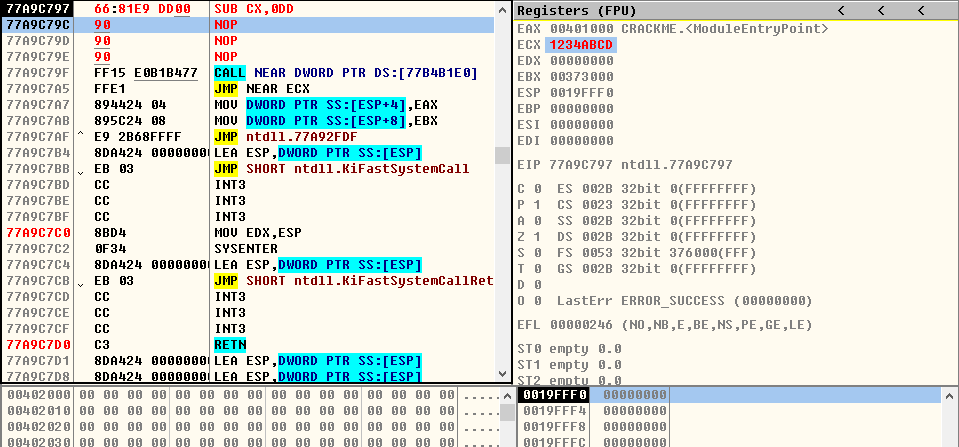
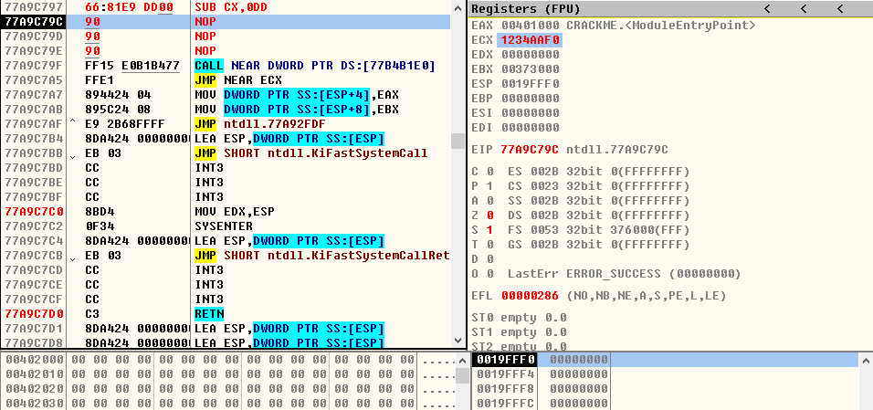
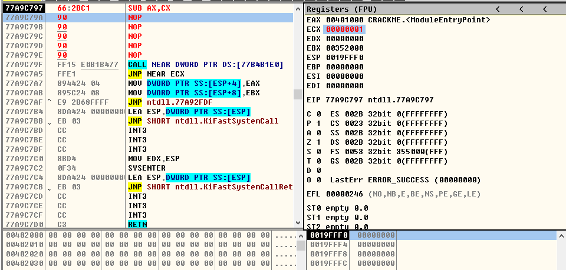

## SUB指令

> 1、SUB r/m8,imm8
- **SUB DL,0xE4**
* ***运行前***

  
 

* ***运行后***

  
 

- **SUB BYTE PTR DS:[0x19FFE8],0x4E**
* ***运行前***

  
 

* ***运行后***

  
 

> 2、SUB r/m16,imm16
- **SUB CX,0x101**
* ***运行前***

  
 

* ***运行后***

  
 

- **SUB WORD PTR DS:[19FFE8],0xDC56**
* ***运行前***

  
 

* ***运行后***

  
 

> 3、SUB r/m32,imm32
- **SUB EAX,0x11000**
* ***运行前***

  
 

* ***运行后***

  
 

- **SUB DWORD PTR DS:[0x19FFE8],0x67ABDC6B**
* ***运行前***

  
 

* ***运行后***

  
 

> 4、SUB r/m16,imm8
- **SUB CX,0xDD**
* ***运行前***

  
 

* ***运行后***

  
 

- **SUB WORD PTR DS:[0x19FFE8],0x49**
* ***运行前***

  
 

* ***运行后***

  
 

> 5、SUB r/m32,imm8
- **SUB ECX,0xAC**
* ***运行前***

  
 

* ***运行后***

  
 

- **SUB DWORD PTR DS:[0x19FF88],0x1**
* ***运行前***

  
 

* ***运行后***

  
 

> 6、SUB r/m8,r8
- **SUB ECX,0xAC**
* ***运行前***

  
 

* ***运行后***

  
 

- **SUB BYTE PTR DS:[0x19FFE8],0xAL**
* ***运行前***

  
 

* ***运行后***

  
 

> 7、SUB r/m16,r16
- **SUB AX,CX**
* ***运行前***

  
 

* ***运行后***

  
 

- **SUB WORD PTR DS:[0x19FFE8],AX**
* ***运行前***

  
 

* ***运行后***

  
 

> 8、SUB r/m32,r32
- **SUB EAX,ECX**
* ***运行前***

  
 

* ***运行后***

  
 

- **SUB DWORD PTR DS:[0x19FFE8],EAX**
* ***运行前***

  
 

* ***运行后***

  
 

> 9、SUB r8,r/m8
- **SUB CH,CL**
* ***运行前***

  
 

* ***运行后***

  
 

- **SUB AL,BYTE PTR DS:[0x19FFE8]**
* ***运行前***

  
 

* ***运行后***

  
 

> 10、SUB r16,r/m16
- **SUB AX,CX**
* ***运行前***

  
 

* ***运行后***

  
 

- **SUB AX,WORD PTR DS:[0x19FF90]**
* ***运行前***

  
 

* ***运行后***

  
 