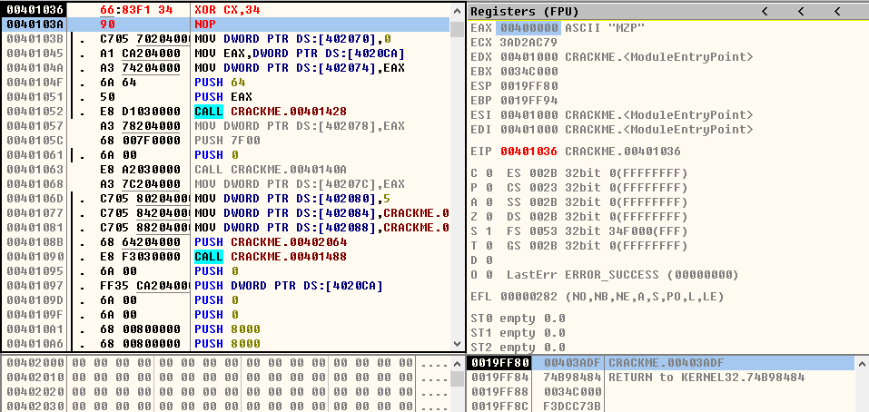
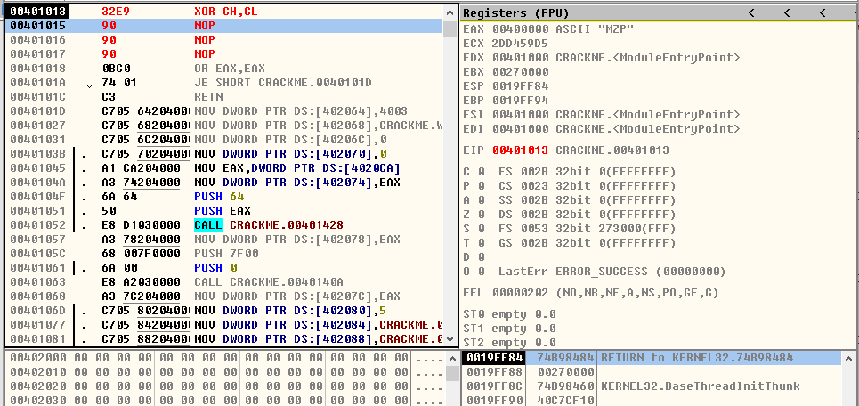

## XOR指令

> 1、XOR r/m8,imm8
- **XOR AL,0x56**
* ***运行前***

  
 

* ***运行后***

  
  

- **XOR BYTE PTR DS:[0x19FF8C],0x7A**
* ***运行前***

  
 

* ***运行后***

  
 

> 2、XOR r/m16,imm16
- **XOR CX,0x3456**
* ***运行前***

  
 

* ***运行后***

  
  

- **XOR WORD PTR DS:[0x19FF80],0x1A2B**
* ***运行前***

  
 

* ***运行后***

  
 

> 3、XOR r/m32,imm32
- **XOR ECX,0x12345678**
* ***运行前***

  
 

* ***运行后***

  
  

- **XOR DWORD PTR DS:[0x19FF8C],0x87654321**
* ***运行前***

  
 

* ***运行后***

  
 

> 4、XOR r/m16,imm8
- **XOR CX,0x34**
* ***运行前***

  
 

* ***运行后***

  
  

- **XOR WORD PTR DS:[0x19FF8C],0xAD**
* ***运行前***

  
 

* ***运行后***

  
 

> 5、XOR r/m32,imm8
- **XOR ECX,0x29**
* ***运行前***

  
 

* ***运行后***

  
  

- **XOR DWORD PTR DS:[0x19FF90],0x35**
* ***运行前***

  
 

* ***运行后***

  
 

> 6、XOR r/m8,r8
- **XOR CH,CL**
* ***运行前***

  
 

* ***运行后***

  
  

- **XOR BYTE PTR DS:[0x19FF84],CL**
* ***运行前***

  
 

* ***运行后***

  
 

> 7、XOR r/m16,r16
- **XOR CX,SP**
* ***运行前***

  
 

* ***运行后***

  
  

- **XOR WORD PTR DS:[0x19FF8C],CX**
* ***运行前***

  
 

* ***运行后***

  
 

> 8、XOR r/m32,r32
- **XOR EAX,ECX**
* ***运行前***

  
 

* ***运行后***

  
  

- **XOR DWORD PTR DS:[0x19FF88],EBX**
* ***运行前***

  
 

* ***运行后***

  
 

> 9、XOR r8,r/m8
- **XOR AH,AL**
* ***运行前***

  
 

* ***运行后***

  
  

- **XOR AL,BYTE PTR DS:[0x19FF90]**
* ***运行前***

  
 

* ***运行后***

  
 

> 10、XOR r16,r/m16
- **XOR AX,SP**
* ***运行前***

  
 

* ***运行后***

  
  

- **XOR AX,WORD PTR DS:[0x19FF8C]**
* ***运行前***

  
 

* ***运行后***

  
 

> 11、XOR r32,r/m32
- **XOR EAX,EBX**
* ***运行前***

  
 

* ***运行后***

  
  

- **XOR EAX,DWORD PTR DS:[0x19FF84]**
* ***运行前***

  
 

* ***运行后***

  
 